<div align="center">

# 🚀 Spring Boot CI/CD Pipeline with Monitoring

### End-to-End DevOps Project using Spring Boot, Jenkins, SonarQube, Docker, Prometheus, Grafana & Alertmanager


**A complete CI/CD pipeline with automated build, testing, code quality analysis, Docker image creation, Docker Hub publishing, application monitoring, dashboard visualization and email alerting.**


---

# 📚 Table of Contents

- Project Overview
- Architecture
- Technology Stack
- Project Structure
- CI/CD Workflow
- Jenkins Pipeline
- Docker
- SonarQube
- Monitoring Stack
- Docker Hub
- Running the Project
- Screenshots
- Challenges Faced
- Learning Outcomes
- Future Improvements
- Author

---

# 📌 Project Overview

This project demonstrates a production-style DevOps workflow for a Spring Boot application.

Whenever a developer pushes code to GitHub, Jenkins automatically performs the following tasks:

- Checkout Source Code
- Build Application
- Execute Unit Tests
- Static Code Analysis using SonarQube
- Build Docker Image
- Push Docker Image to Docker Hub

After deployment, the application is continuously monitored using:

- Spring Boot Actuator
- Micrometer
- Prometheus
- Grafana
- Alertmanager

This project simulates a real DevOps workflow commonly used in enterprise environments.

---

# 🏗 Architecture

```text
                     Developer
                         │
                         ▼
                  GitHub Repository
                         │
                         ▼
                  Jenkins Pipeline
                         │
      ┌──────────────────┼─────────────────┐
      │                  │                 │
      ▼                  ▼                 ▼
 Checkout           Build/Test      SonarQube Scan
      │                  │                 │
      └──────────────────┼─────────────────┘
                         ▼
                Docker Image Build
                         │
                         ▼
                 Docker Hub Registry
                         │
                         ▼
              Spring Boot Container
                         │
               /actuator/prometheus
                         │
                         ▼
                  Prometheus Server
                         │
                         ▼
                  Grafana Dashboard
                         │
                         ▼
                   Alertmanager
                         │
                         ▼
                Email Notifications
```

---

# 🛠 Technology Stack

| Category | Technology |
|-----------|------------|
| Language | Java 21 |
| Framework | Spring Boot |
| Build Tool | Maven |
| Version Control | Git |
| Repository | GitHub |
| CI/CD | Jenkins |
| Code Analysis | SonarQube |
| Containerization | Docker |
| Registry | Docker Hub |
| Monitoring | Prometheus |
| Visualization | Grafana |
| Alerting | Alertmanager |
| OS | Ubuntu |

---

# 📂 Project Structure

```text
springboot-cicd-pipeline
│
├── src
│
├── Dockerfile
├── Dockerfile.jenkins
├── Jenkinsfile
├── pom.xml
├── mvnw
├── README.md
└── HELP.md
```

---

# ⚙ CI/CD Workflow

## Stage 1 — Checkout

Jenkins clones the latest code from the **dev** branch.

---

## Stage 2 — Build

```bash
./mvnw clean package
```

Compiles the application and generates the executable JAR.

---

## Stage 3 — Unit Testing

```bash
./mvnw test
```

Runs unit tests before creating the Docker image.

---

## Stage 4 — SonarQube Analysis

The application source code is analyzed for:

- Bugs
- Vulnerabilities
- Code Smells
- Security Hotspots
- Maintainability
- Code Duplication

---

## Stage 5 — Docker Image Build

```bash
docker build -t springboot-cicd .
```

Creates the Docker image.

---

## Stage 6 — Docker Login

Jenkins authenticates securely using stored Docker Hub credentials.

---

## Stage 7 — Docker Push

```bash
docker push prameet26/springboot-cicd:latest
```

Publishes the image to Docker Hub.

---

# 🐳 Docker

The application is packaged as a Docker container.

Benefits include:

- Consistent runtime
- Easy deployment
- Environment independence
- Versioned images
- Simplified scaling

---

# 🔍 SonarQube

Integrated with Jenkins to ensure code quality before deployment.

Checks include:

- Bugs
- Vulnerabilities
- Security Hotspots
- Maintainability Rating
- Code Smells
- Duplicated Code

---

# 📊 Monitoring Stack

## Spring Boot Actuator

Exposes application metrics.

```
/actuator/prometheus
```

---

## Micrometer

Collects JVM and application metrics.

Examples:

- CPU Usage
- Heap Memory
- Thread Count
- HTTP Requests
- Response Time

---

## Prometheus

Prometheus scrapes metrics from the application every few seconds.

---

## Grafana

Visualizes metrics using dashboards.

Dashboard Panels include:

- JVM Memory
- CPU Usage
- Request Count
- Response Time
- Application Health
- Uptime

---

## Alertmanager

Receives alerts from Prometheus.

Configured Alerts

- Spring Boot Application Down
- Instance Down

Notification Method

- Gmail SMTP Email

---

# 📦 Docker Hub Repository

```
Repository:
prameet26/springboot-cicd

Image Tag:
latest
```

Every successful Jenkins build pushes a fresh Docker image.

---

# 🚀 Running the Project

Clone Repository

```bash
git clone https://github.com/Prameet-26/springboot-cicd-pipeline.git
```

Build

```bash
./mvnw clean package
```

Docker Build

```bash
docker build -t springboot-cicd .
```

Run

```bash
docker run -d -p 8081:8080 springboot-cicd
```

Application

```
http://localhost:8081
```

Metrics Endpoint

```
http://localhost:8081/actuator/prometheus
```

---

# 📸 Screenshots

Create a `screenshots/` folder in your repository and add images such as:

```
screenshots/
│
├── github-repository.png
├── jenkins-dashboard.png
├── successful-pipeline.png
├── sonarqube-dashboard.png
├── docker-desktop.png
├── dockerhub.png
├── prometheus-targets.png
├── grafana-dashboard.png
└── alert-email.png
```

Then embed them in the README:

# 📸 Project Execution Screenshots

## 1. GitHub Repository

### Main Branch

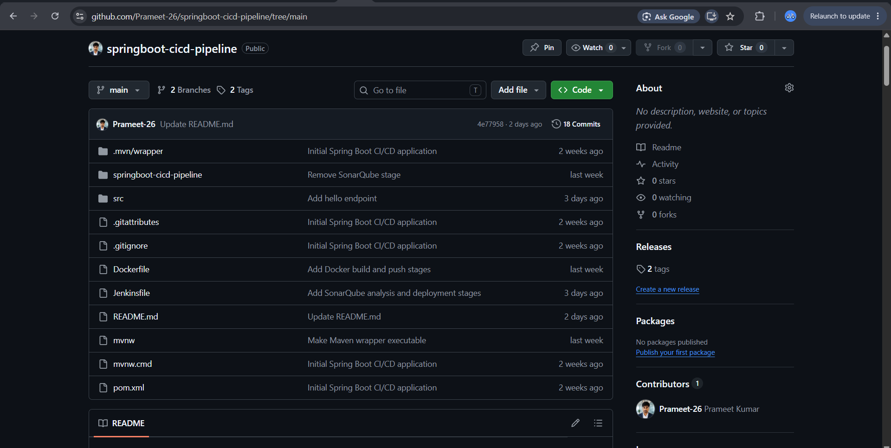

### Development Branch

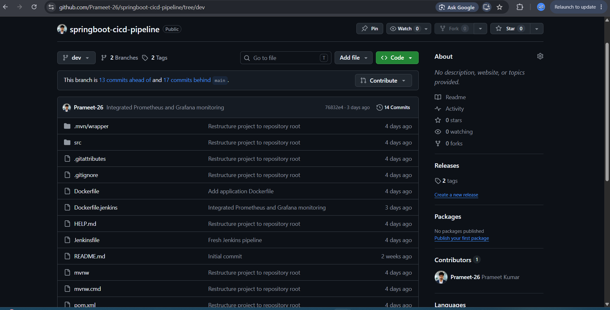

---

## 2. AWS EC2 Instance

The CI/CD pipeline and monitoring stack are deployed on an AWS EC2 instance.

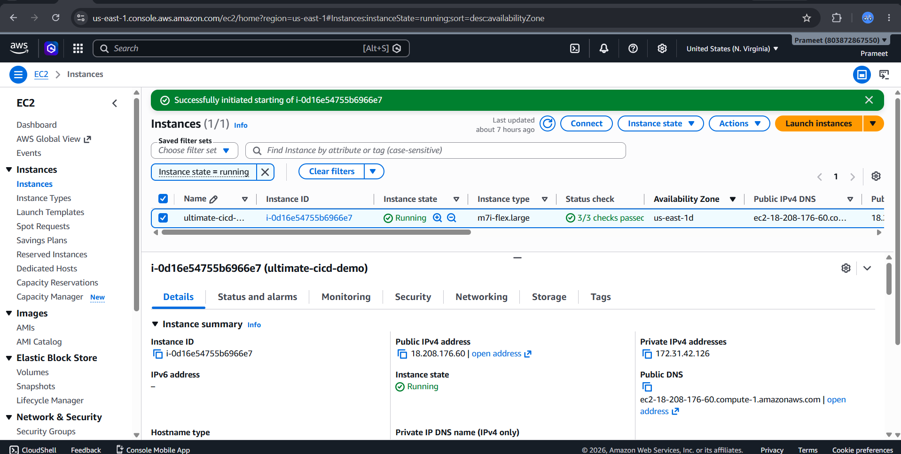

---

## 3. Docker


### Running Containers

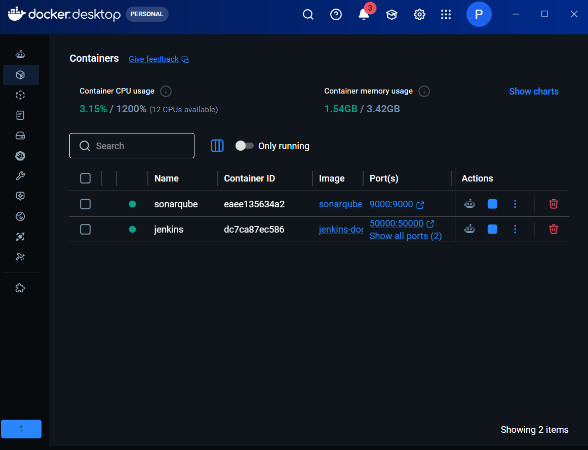

---

## 4. Jenkins Pipeline

### Pipeline Execution

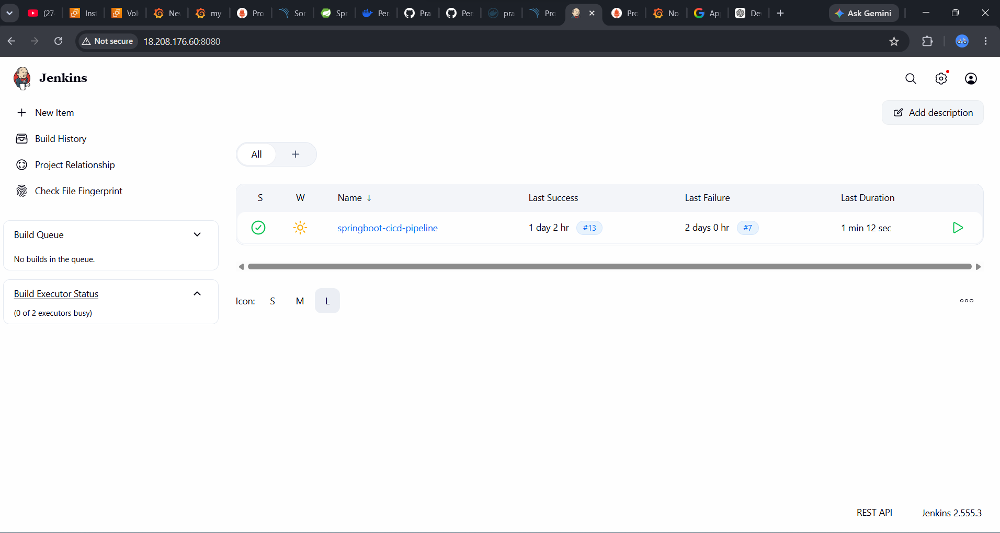

### Successful Build

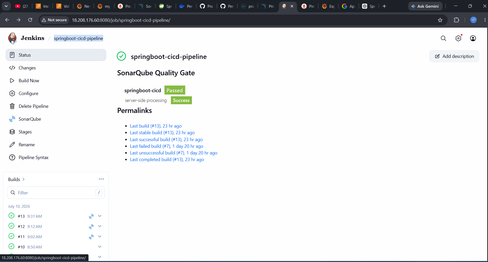

---

## 5. SonarQube Code Quality

Static code analysis performed successfully.

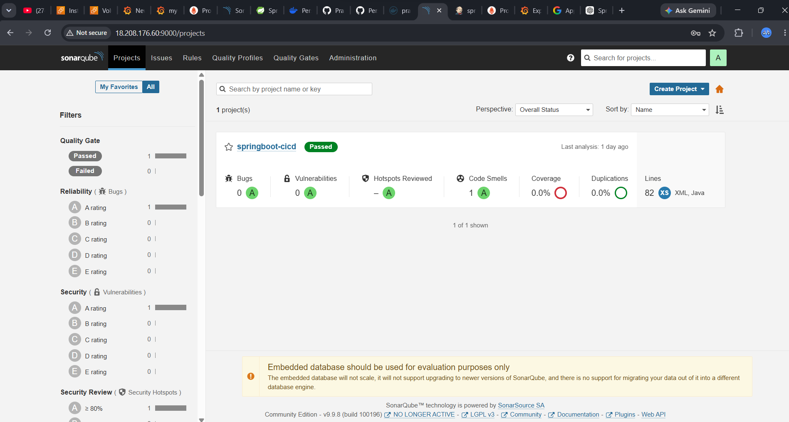

---

## 6. Spring Boot Application

Application deployed successfully through the Jenkins pipeline.

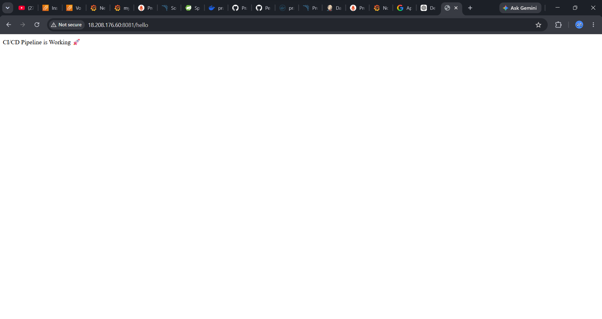

---

## 7. Docker Hub Image

Docker image pushed automatically by Jenkins.

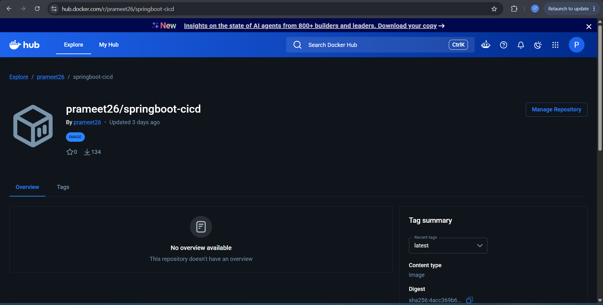

---

## 8. Prometheus Monitoring

Prometheus successfully scraping Spring Boot application metrics.

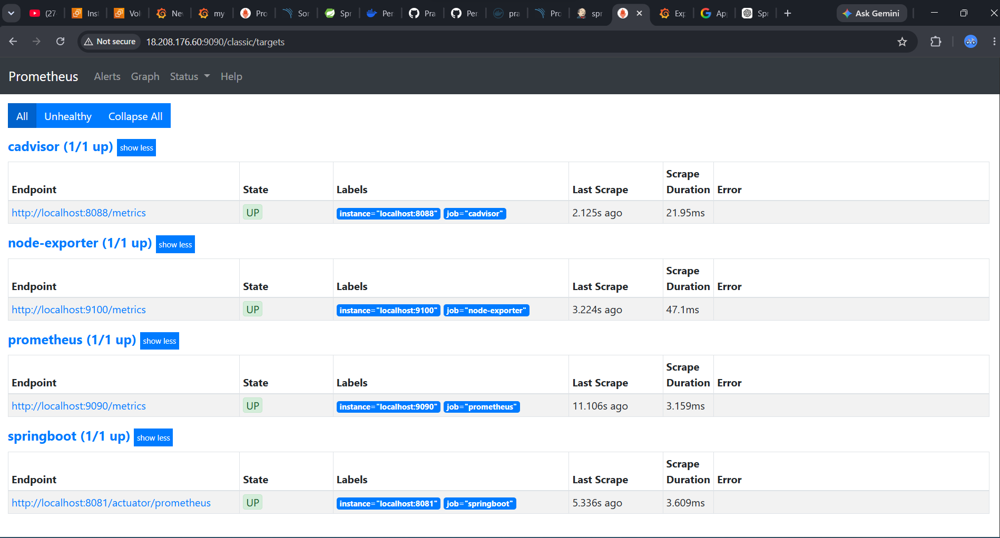

---

## 9. Grafana Dashboards

### Dashboard 1

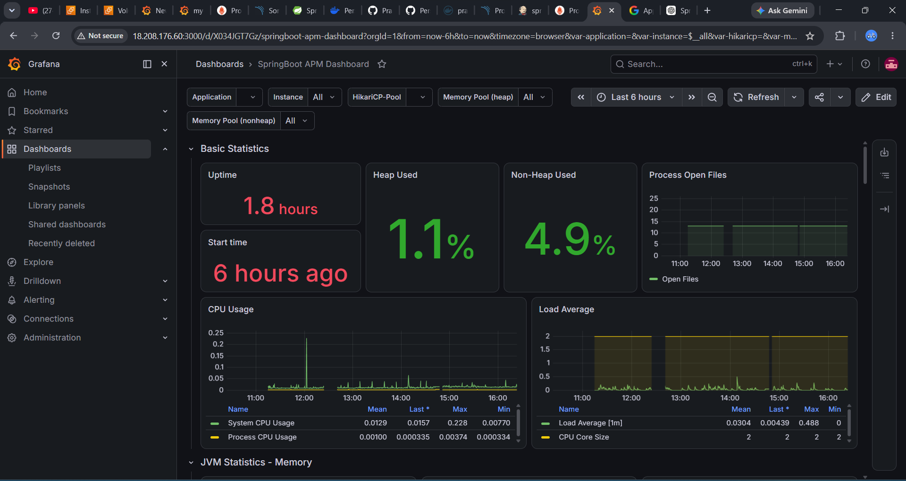

### Dashboard 2

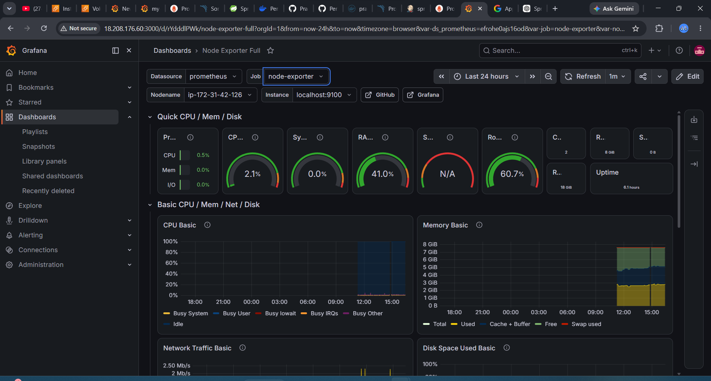

---

## 10. Email Alerting

Alertmanager successfully sends email notifications when the Spring Boot application becomes unavailable.

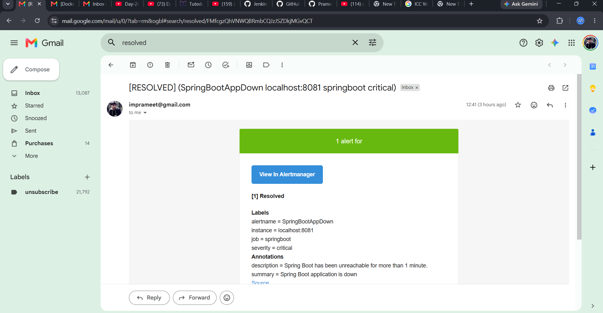
---

🚧 Challenges Faced During Development
1. Jenkins Could Not Execute Docker Commands
❌ Problem

The Jenkins pipeline failed during the Docker build stage with:

docker: command not found
🔍 Root Cause

Although Docker was installed on the Ubuntu host, the Jenkins container had no access to the Docker CLI or Docker daemon.

✅ Solution
Mounted the Docker socket (/var/run/docker.sock)
Mounted the Docker binary into the Jenkins container
Recreated the Jenkins container with the required volume mappings
Verified Docker access by running docker --version inside the Jenkins container
🎯 Learning

I learned how Jenkins communicates with Docker and why mounting the Docker socket is essential for containerized Jenkins deployments.

2. Docker Image Push Failed
❌ Problem

The pipeline built the image successfully but failed while pushing it to Docker Hub.

🔍 Root Cause

Docker Hub credentials were not configured correctly in Jenkins.

✅ Solution
Created Docker Hub credentials in Jenkins.
Updated the Jenkinsfile to authenticate using Jenkins credentials.
Successfully pushed the image after authentication.
🎯 Learning

I learned how to securely manage credentials in Jenkins instead of hardcoding usernames and passwords.

3. SonarQube Integration Failed
❌ Problem

Static code analysis did not execute successfully.

🔍 Root Cause

SonarQube server and authentication token were not configured correctly.

✅ Solution
Started the SonarQube container.
Generated a project token.
Configured the SonarQube server in Jenkins.
Updated the pipeline to use the token.
🎯 Learning

I learned how Jenkins integrates with SonarQube for automated code quality analysis.

4. Prometheus Was Not Collecting Metrics
❌ Problem

Prometheus displayed the application as DOWN.

🔍 Root Cause

The scrape configuration pointed to an incorrect endpoint.

✅ Solution
Updated the Prometheus configuration.
Verified the /actuator/prometheus endpoint.
Reloaded Prometheus.
Confirmed the target status changed to UP.
🎯 Learning

I learned how Prometheus discovers services and scrapes application metrics.

5. Grafana Dashboard Showed No Data
❌ Problem

Dashboards loaded but displayed empty graphs.

🔍 Root Cause

Grafana was not connected to the correct Prometheus data source.

✅ Solution
Configured Prometheus as the data source.
Imported dashboards.
Verified PromQL queries.
🎯 Learning

I learned how Grafana visualizes metrics collected by Prometheus.

6. Email Alerts Were Not Received
❌ Problem

Alertmanager generated alerts but no emails arrived.

🔍 Root Cause

SMTP configuration and Gmail authentication were incomplete.

✅ Solution
Configured Gmail SMTP.
Generated a Gmail App Password.
Updated Alertmanager configuration.
Triggered a test alert successfully.
🎯 Learning

I learned how production monitoring systems notify engineers during application failures.

📚 Overall Lessons Learned

Through this project, I gained hands-on experience in:

Designing and implementing an end-to-end CI/CD pipeline.
Troubleshooting Jenkins pipeline failures.
Integrating Docker with Jenkins.
Performing automated static code analysis with SonarQube.
Deploying containerized Spring Boot applications.
Monitoring applications using Prometheus and Grafana.
Configuring Alertmanager for automated email notifications.
Debugging real-world infrastructure, networking, and authentication issues.
---

# 🎯 Key Learning Outcomes

- Built an end-to-end CI/CD pipeline
- Integrated SonarQube for code quality analysis
- Automated Docker image creation and publishing
- Implemented monitoring using Prometheus and Grafana
- Configured email alerts using Alertmanager
- Learned Jenkins Declarative Pipelines
- Improved troubleshooting skills across multiple DevOps tools

---

# 🔮 Future Enhancements

- Kubernetes Deployment
- Amazon ECS/Fargate Deployment
- Terraform Infrastructure
- Helm Charts
- GitHub Actions
- Argo CD
- Blue-Green Deployment
- Rolling Updates
- Kubernetes Monitoring

---

# 👨‍💻 Author

**Prameet Kumar**

**GitHub:** https://github.com/Prameet-26

**Docker Hub:** https://hub.docker.com/u/prameet26

---

## ⭐ If you found this project helpful, consider giving it a star!
