# 🚀 Enterprise DevSecOps CI/CD Pipeline for Spring Boot on AWS EKS

<p align="center">


</p>

---

## 📌 Project Overview

This repository demonstrates a **production-ready Enterprise DevSecOps CI/CD Pipeline** for deploying a **Spring Boot application** on **Amazon Elastic Kubernetes Service (Amazon EKS)**.

The project automates the complete software delivery lifecycle—from source code management and continuous integration to security validation, containerization, Kubernetes deployment, monitoring, and automated alerting.

Unlike a traditional CI/CD pipeline, this implementation follows **DevSecOps principles**, integrating security into every stage of the pipeline to identify vulnerabilities early and improve software quality before deployment.

The solution combines modern DevOps and Cloud-Native technologies to simulate an enterprise deployment workflow used in production environments.

---

## ⭐ Project Highlights

- 🚀 End-to-End Enterprise DevSecOps Pipeline
- ☁️ Production-Style Deployment on AWS
- ☸️ Amazon Elastic Kubernetes Service (EKS)
- 🔄 Automated Jenkins CI/CD Pipeline
- 🔍 Static Code Analysis with SonarQube
- 🛡️ Dependency Vulnerability Scanning using OWASP Dependency-Check
- 🐳 Docker Image Build and Publishing
- 📦 Automated Kubernetes Deployment
- 📈 Prometheus Monitoring
- 📊 Grafana Dashboards
- 🚨 Alertmanager Email Notifications
- ⚡ Infrastructure Hosted on AWS EC2
- 🔒 Shift-Left Security Implementation
- 📋 Production Monitoring & Observability

---

# 🏗️ Solution Architecture

> **Complete Enterprise DevSecOps Workflow**

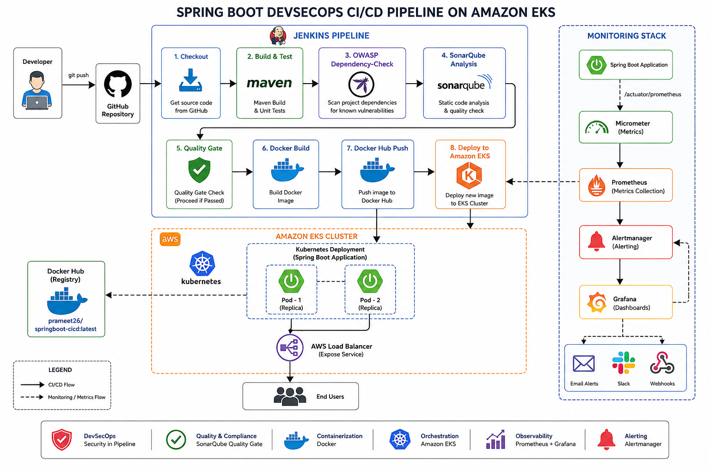

---

# 🎯 Project Objectives

| Objective | Status |
|-----------|:------:|
| Build an End-to-End CI/CD Pipeline | ✅ |
| Automate Software Delivery | ✅ |
| Integrate DevSecOps Practices | ✅ |
| Deploy Application on Amazon EKS | ✅ |
| Implement Static Code Analysis | ✅ |
| Perform Dependency Security Scanning | ✅ |
| Containerize using Docker | ✅ |
| Monitor Infrastructure & Application | ✅ |
| Configure Automated Email Alerts | ✅ |
| Demonstrate Enterprise DevOps Workflow | ✅ |

---

# 📊 Project Statistics

| Category | Technology |
|-----------|------------|
| Application | Spring Boot |
| Programming Language | Java 21 |
| Build Tool | Maven |
| Version Control | Git |
| Repository | GitHub |
| CI/CD | Jenkins |
| Code Quality | SonarQube |
| Security Scanning | OWASP Dependency-Check |
| Container Platform | Docker |
| Image Registry | Docker Hub |
| Container Orchestration | Kubernetes |
| Kubernetes Platform | Amazon EKS |
| Cloud Provider | Amazon Web Services (AWS) |
| Monitoring | Prometheus |
| Dashboard | Grafana |
| Alerting | Alertmanager |
| Operating System | Ubuntu Linux |

---

# 📚 Table of Contents

- 📌 Project Overview
- ⭐ Project Highlights
- 🏗️ Solution Architecture
- 🛠️ Technology Stack
- ⚙️ DevSecOps Workflow
- 🔄 CI/CD Pipeline
- ☁️ AWS Infrastructure
- 🔍 Jenkins Automation
- 🛡️ Security Integration
- 🐳 Docker & Containerization
- ☸️ Kubernetes Deployment
- 📈 Monitoring & Observability
- 📸 Project Screenshots
- 🚀 Future Enhancements
- 🎓 Skills Demonstrated
- 👨‍💻 Author

---

# 🛠️ Technology Stack

| Category | Technologies |
|-----------|--------------|
| Programming Language | Java 21 |
| Framework | Spring Boot |
| Build Tool | Maven |
| Version Control | Git |
| Source Code Repository | GitHub |
| Continuous Integration | Jenkins |
| Code Quality Analysis | SonarQube |
| Security Scanning | OWASP Dependency-Check |
| Containerization | Docker |
| Image Registry | Docker Hub |
| Container Orchestration | Kubernetes |
| Cloud Platform | AWS |
| Managed Kubernetes | Amazon EKS |
| Monitoring | Prometheus |
| Visualization | Grafana |
| Alerting | Alertmanager |
| Operating System | Ubuntu Linux |

---

# ✨ Key Features

## 🚀 Continuous Integration & Delivery

- Automated Jenkins Pipeline
- GitHub Integration
- Maven Build Automation
- Unit Testing
- Docker Image Build
- Docker Hub Image Publishing
- Automated Kubernetes Deployment

---

## 🛡️ DevSecOps

- Static Code Analysis using SonarQube
- OWASP Dependency Vulnerability Scanning
- Quality Gate Validation
- Shift-Left Security
- Automated Security Reports
- Secure Software Delivery Pipeline

---

## ☁️ Cloud Infrastructure

- Amazon EC2
- Amazon EKS
- Kubernetes Deployment
- Docker Containers
- Public Docker Hub Registry
- Cloud-Native Deployment

---

## 📈 Monitoring & Observability

- Prometheus Metrics Collection
- Grafana Dashboards
- Spring Boot Actuator Metrics
- Node Exporter
- Infrastructure Monitoring
- Alertmanager Email Notifications

---
# ⚙️ Enterprise DevSecOps Workflow

This project implements an end-to-end **Enterprise DevSecOps workflow** that automates the complete software delivery lifecycle. Every stage—from source code management to deployment, monitoring, and alerting—is integrated into a single automated pipeline.

The workflow follows **Shift-Left Security**, ensuring that code quality and security checks are performed before the application reaches production.

---

## 🔄 End-to-End Pipeline Workflow

```text
Developer
    │
    ▼
GitHub Repository
    │
    ▼
Jenkins Pipeline
    │
    ├──────────────► Checkout Source Code
    │
    ├──────────────► Maven Build
    │
    ├──────────────► Unit Testing
    │
    ├──────────────► SonarQube Code Analysis
    │
    ├──────────────► Quality Gate Validation
    │
    ├──────────────► OWASP Dependency-Check
    │
    ├──────────────► Docker Image Build
    │
    ├──────────────► Docker Hub Push
    │
    ├──────────────► Deploy to Amazon EKS
    │
    └──────────────► Rollout Verification
    │
    ▼
Spring Boot Application
    │
    ▼
Prometheus
    │
    ▼
Grafana
    │
    ▼
Alertmanager
    │
    ▼
Email Notification

---

# 🏗️ Enterprise Pipeline Stages

| Stage | Tool | Purpose |
|---------|------|---------|
| Source Control | GitHub | Stores application source code |
| Continuous Integration | Jenkins | Automates the CI/CD workflow |
| Build | Maven | Compiles and packages the application |
| Testing | JUnit | Executes automated unit tests |
| Static Code Analysis | SonarQube | Evaluates code quality and maintainability |
| Security Scanning | OWASP Dependency-Check | Detects vulnerable third-party dependencies |
| Containerization | Docker | Packages the application into a portable container |
| Image Registry | Docker Hub | Stores Docker images for deployment |
| Deployment | Amazon EKS | Runs the application on Kubernetes |
| Verification | kubectl | Confirms successful rollout |
| Monitoring | Prometheus | Collects infrastructure and application metrics |
| Visualization | Grafana | Displays real-time dashboards |
| Alerting | Alertmanager | Sends automated email notifications |

---

# 🔄 CI/CD Pipeline Overview

The CI/CD pipeline begins when a developer pushes new code to the GitHub repository.

Jenkins automatically detects the change and triggers a predefined pipeline that performs code compilation, testing, quality analysis, dependency vulnerability scanning, Docker image creation, container publishing, Kubernetes deployment, and deployment verification.

This automation eliminates repetitive manual tasks while ensuring every release follows the same secure and reliable deployment process.

---

## 📋 CI/CD Execution Flow

```text
GitHub Push

        │

        ▼

Jenkins Trigger

        │

        ▼

Checkout Source Code

        │

        ▼

Compile Application

        │

        ▼

Execute Unit Tests

        │

        ▼

SonarQube Analysis

        │

        ▼

Quality Gate Validation

        │

        ▼

OWASP Dependency Scan

        │

        ▼

Build Docker Image

        │

        ▼

Push Docker Image

        │

        ▼

Deploy to Amazon EKS

        │

        ▼

Verify Deployment

        │

        ▼

Application Running

        │

        ▼

Prometheus Monitoring

        │

        ▼

Grafana Dashboards

        │

        ▼

Alertmanager Notifications
```

---

# 🔍 Jenkins Automation

Jenkins acts as the central automation server for the entire DevSecOps pipeline.

Every GitHub commit automatically triggers a new build, allowing the application to be compiled, tested, analyzed, secured, containerized, and deployed without manual intervention.

This ensures repeatable, reliable, and consistent software delivery.

---

## ⚡ Jenkins Responsibilities

- Detect GitHub code changes
- Checkout the latest source code
- Build the application using Maven
- Execute automated unit tests
- Perform SonarQube analysis
- Validate the Quality Gate
- Execute OWASP Dependency-Check
- Build Docker images
- Push Docker images to Docker Hub
- Deploy the application to Amazon EKS
- Verify deployment rollout
- Generate detailed build logs

---

# 📷 Jenkins Dashboard

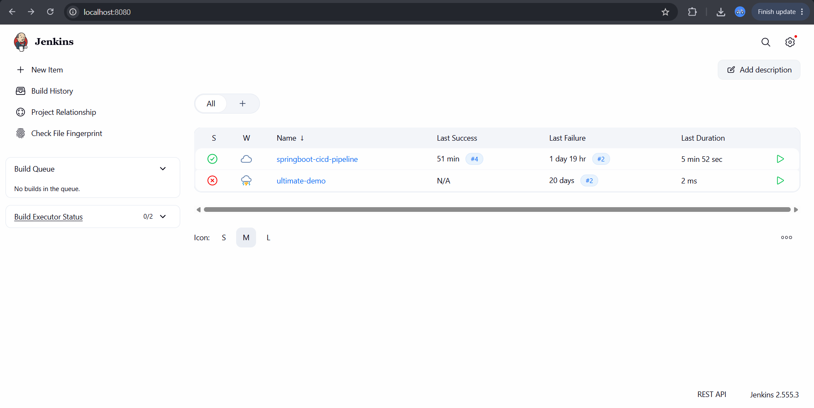

The Jenkins Dashboard provides a centralized view of all pipeline executions, allowing developers to monitor build status, review execution history, and quickly identify failed or successful deployments.

---

# 📷 Jenkins Pipeline Execution

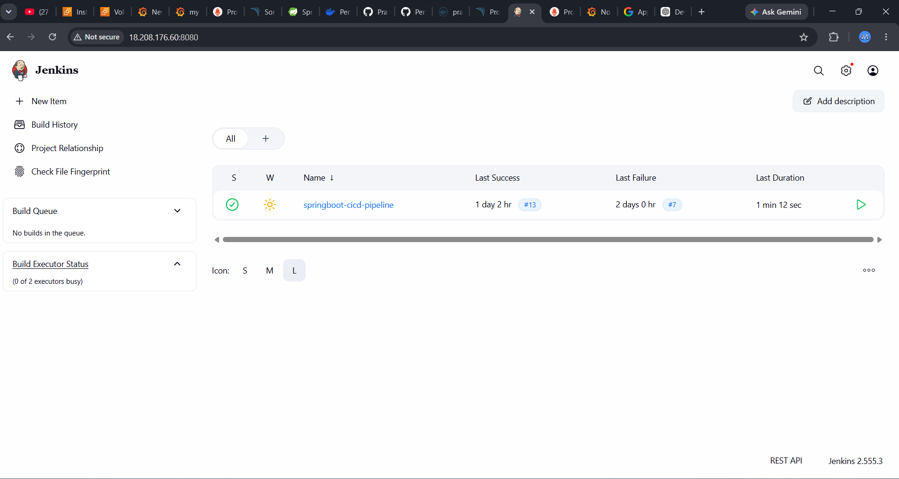

The Pipeline View illustrates every stage of the DevSecOps workflow. Each stage must complete successfully before the pipeline proceeds to the next, ensuring consistent quality throughout the deployment process.

---

# 📷 Jenkins Console Output


The Jenkins Console Output records detailed logs for each stage, including build progress, security scans, Docker operations, Kubernetes deployment, and rollout verification. These logs are essential for troubleshooting and auditing pipeline executions.

---

# 📷 Successful Pipeline Execution

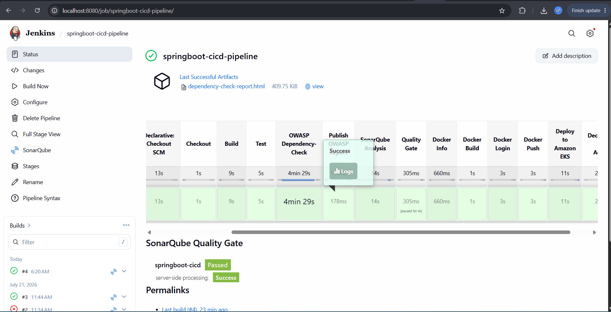

A successful pipeline confirms that the application has passed all validation, security, and deployment stages before being released to the Kubernetes cluster.

---

# 🔨 Build & Test Stage

The pipeline starts by retrieving the latest application source code from GitHub and compiling it using Maven.

During this phase Jenkins:

- Resolves project dependencies
- Compiles Java source code
- Packages the application
- Generates executable artifacts
- Prepares the application for deployment

Automated unit tests are executed immediately after the build process to validate application functionality before continuing to the security stages.

---

# 🔎 Static Code Analysis using SonarQube

Maintaining high code quality is essential for building secure and maintainable software.

This project integrates **SonarQube** directly into the Jenkins pipeline to perform automated static code analysis on every build.

The analysis identifies:

- Bugs
- Code Smells
- Vulnerabilities
- Security Hotspots
- Duplicated Code
- Maintainability Issues
- Reliability Problems

By identifying these issues early, developers can improve application quality before deployment.

---

# 📷 SonarQube Dashboard

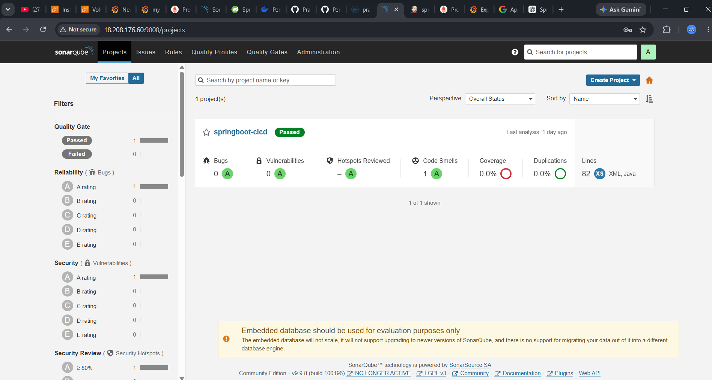

The SonarQube dashboard provides a comprehensive overview of code quality metrics, enabling developers to monitor technical debt, maintainability, security findings, and overall project health.

---

# 🚦 Quality Gate Validation

After the analysis completes, Jenkins waits for the SonarQube Quality Gate result.

| Quality Gate Result | Pipeline Action |
|---------------------|-----------------|
| ✅ Pass | Continue Pipeline |
| ❌ Fail | Stop Deployment |

This mechanism prevents low-quality or insecure code from progressing further in the deployment pipeline.

---

# 🛡️ OWASP Dependency-Check

In addition to source code analysis, this project integrates **OWASP Dependency-Check** to perform Software Composition Analysis (SCA).

The tool scans all third-party libraries used by the application and compares them against the National Vulnerability Database (NVD) to detect publicly disclosed security vulnerabilities.

This enables early identification of vulnerable dependencies before they reach production.

---

## 🔒 Security Validation

OWASP Dependency-Check identifies:

- Known CVEs
- Vulnerable third-party libraries
- Outdated dependencies
- High-risk packages
- Security recommendations
- Dependency risk reports

This implementation strengthens the pipeline by incorporating **Shift-Left Security**, ensuring security validation occurs during the CI/CD process rather than after deployment.

---

# 📷 OWASP Dependency Report

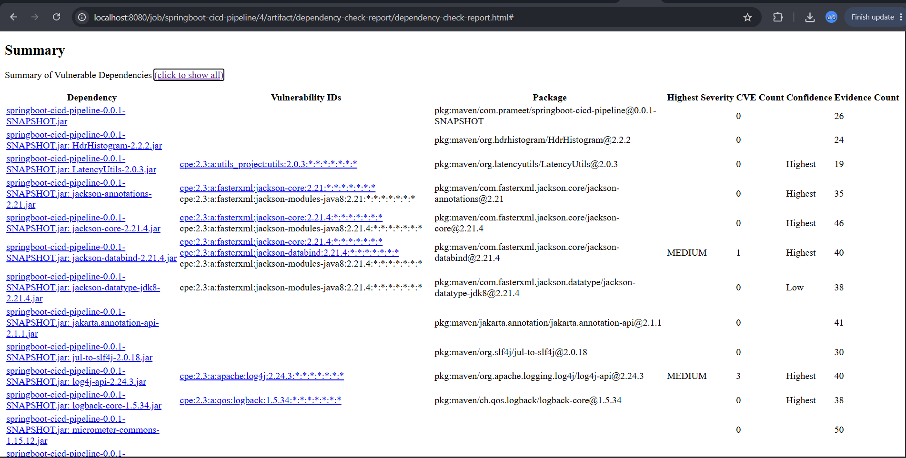

The generated HTML report provides detailed information about detected vulnerabilities, affected dependencies, CVSS scores, severity levels, and recommended remediation actions.

Developers can use these insights to update vulnerable libraries before releasing the application.

# ☁️ Cloud Infrastructure on AWS

The entire DevSecOps solution is deployed on **Amazon Web Services (AWS)** to simulate a production-grade cloud environment.

AWS provides scalable, highly available, and secure infrastructure for hosting the CI/CD pipeline, containerized application, Kubernetes cluster, and monitoring stack.

This project leverages multiple AWS services to automate software delivery while following modern cloud-native deployment practices.

---

# 🏗️ AWS Infrastructure Overview

| AWS Service | Purpose |
|-------------|---------|
| Amazon EC2 | Hosts Jenkins, SonarQube, Prometheus, Grafana, and supporting services |
| Amazon EKS | Managed Kubernetes cluster for application deployment |
| IAM | Secure authentication and authorization |
| VPC | Network isolation for cloud resources |
| Security Groups | Firewall rules for controlled access |
| Docker Hub | Stores application container images |

---

# 🌐 AWS Architecture

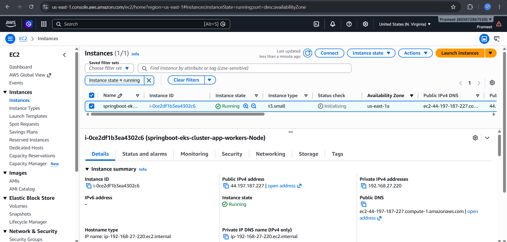

The infrastructure is designed to separate CI/CD services from the Kubernetes platform while maintaining secure communication between all components.

---

# ☸️ Amazon Elastic Kubernetes Service (Amazon EKS)

Amazon Elastic Kubernetes Service (Amazon EKS) is a fully managed Kubernetes platform that simplifies container orchestration without requiring manual control plane management.

After a successful CI/CD execution, Jenkins deploys the latest Docker image to Amazon EKS using Kubernetes manifests.

Amazon EKS automatically schedules containers across worker nodes, ensuring high availability, scalability, and efficient resource utilization.

---

## ⭐ Why Amazon EKS?

- Fully Managed Kubernetes
- High Availability
- Automatic Control Plane Management
- Secure IAM Integration
- Easy Horizontal Scaling
- Enterprise-grade Reliability
- Native AWS Integration
- Production-ready Container Platform

---

# 🏗️ Kubernetes Cluster Components

The Kubernetes environment consists of several core resources working together to provide reliable application deployment.

| Resource | Purpose |
|----------|---------|
| Deployment | Maintains desired number of application replicas |
| ReplicaSet | Ensures application availability |
| Pods | Runs Spring Boot containers |
| Service | Exposes the application within the cluster |
| LoadBalancer | Makes the application accessible externally |
| Namespace | Organizes Kubernetes resources |
| Nodes | Execute application workloads |

---

# 📷 Amazon EKS Cluster

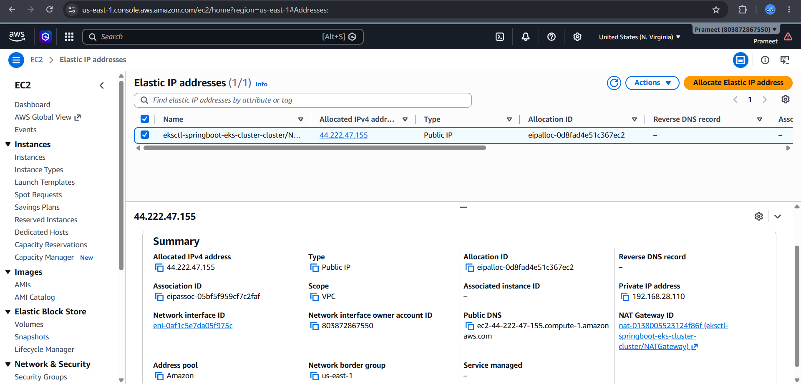

The Amazon EKS console displays the managed Kubernetes cluster responsible for hosting the Spring Boot application in a highly available environment.

---

# 🐳 Docker Containerization

Docker is used to package the Spring Boot application and all its runtime dependencies into a lightweight, portable container image.

This ensures the application behaves consistently across development, testing, and production environments.

Every successful Jenkins pipeline generates a new Docker image before deployment.

---

## Docker Workflow

```text
Spring Boot Source Code

        │

        ▼

Maven Build

        │

        ▼

Docker Build

        │

        ▼

Docker Image

        │

        ▼

Docker Hub

        │

        ▼

Amazon EKS
```

---

## 📦 Docker Build Process

The Docker image creation stage performs the following tasks:

- Packages the Spring Boot application
- Creates a lightweight container image
- Tags the image with the appropriate version
- Pushes the image to Docker Hub
- Makes the image available for Kubernetes deployment

---

# 📷 Docker Image Build

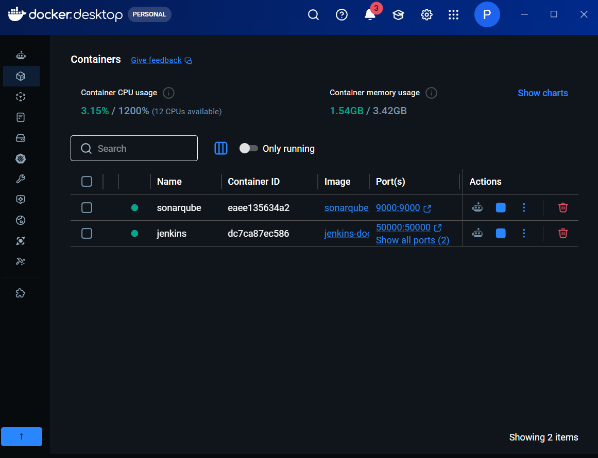

The Docker build stage packages the application into a production-ready container image that can be deployed consistently across environments.

---

# 📷 Docker Hub Repository


After a successful build, Jenkins pushes the Docker image to Docker Hub, making it available for automated deployment to Amazon EKS.

---

# 🚀 Kubernetes Deployment

Once the Docker image is published, Jenkins deploys the updated application to Amazon EKS using Kubernetes manifests.

The deployment process is fully automated, eliminating manual intervention while ensuring consistency across releases.

---

## Deployment Workflow

```text
Docker Hub

      │

      ▼

kubectl Apply

      │

      ▼

Deployment

      │

      ▼

ReplicaSet

      │

      ▼

Pods

      │

      ▼

Service

      │

      ▼

Load Balancer

      │

      ▼

Users
```

---

# ⚙️ Deployment Strategy

This project uses Kubernetes Deployments to manage application lifecycle.

Benefits include:

- Rolling Updates
- Zero-Downtime Deployment
- Replica Management
- Automatic Self-Healing
- Easy Rollback
- High Availability

Whenever a new image becomes available, Kubernetes gradually replaces older Pods with new ones while keeping the application accessible.

---

# 📷 Kubernetes Deployment

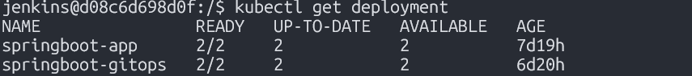

The Deployment resource manages application updates and ensures that the desired number of application replicas remain available at all times.

---

# 📷 Kubernetes Pods

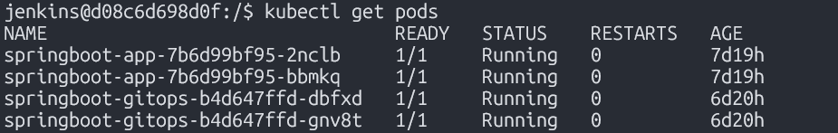

Each Pod represents a running instance of the Spring Boot application.

Kubernetes continuously monitors Pod health and automatically recreates failed Pods to maintain service availability.

---

# 📷 Kubernetes Services

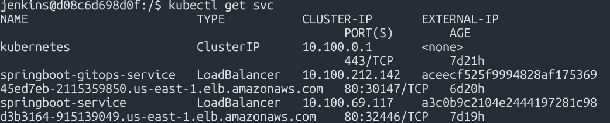

The Kubernetes Service provides a stable network endpoint that enables communication between users and the deployed application.

It also performs load balancing across all healthy application Pods.

---

# 🌍 Application Access

Once the deployment is complete, the application becomes accessible through the Kubernetes LoadBalancer Service.

Users can access the Spring Boot application without needing to know the underlying Pod or Node details.

This abstraction allows Kubernetes to replace, scale, or reschedule Pods without impacting end users.

---

# 📷 Running Spring Boot Application

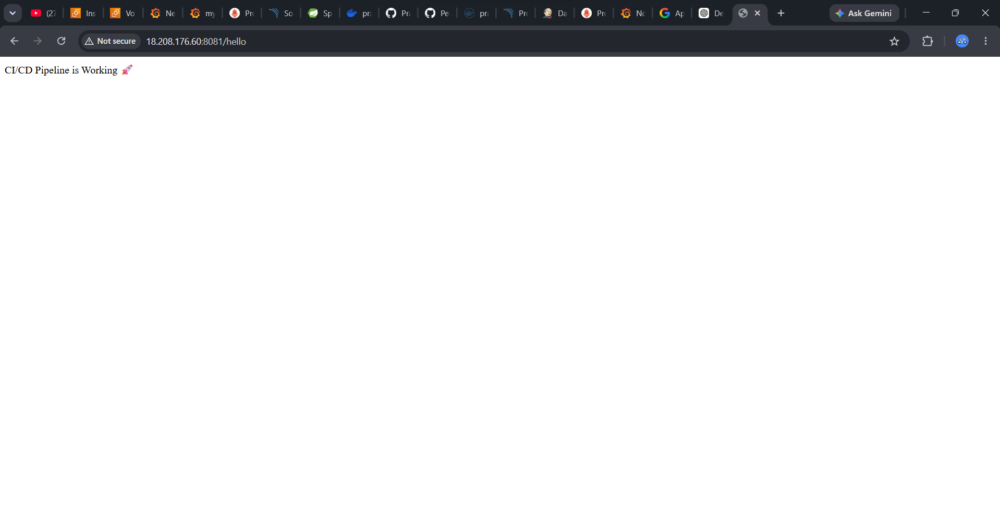

The successful application response confirms that the complete DevSecOps pipeline—from source code to Kubernetes deployment—has executed successfully and the application is running on Amazon EKS.

---

# ✅ Deployment Verification

After deployment, Jenkins verifies that Kubernetes resources are healthy before marking the pipeline as successful.

Verification includes:

- Deployment Status
- Replica Availability
- Pod Health
- Service Status
- Rollout Completion
- Application Accessibility

Only after these checks pass does the pipeline complete successfully, ensuring that every release is fully validated before being considered production-ready.

---
# 📈 Monitoring & Observability

Modern cloud-native applications require continuous monitoring to ensure reliability, availability, and performance.

This project implements a complete **observability stack** using **Prometheus**, **Grafana**, **Node Exporter**, **Spring Boot Actuator**, and **Alertmanager**.

Together, these tools provide real-time visibility into application health, infrastructure performance, and automated incident notifications.

---

# 🏗️ Monitoring Architecture

```text
                 Spring Boot Application
                         │
                         │
               Spring Boot Actuator
                         │
                         ▼
                   Prometheus Server
                   ▲              ▲
                   │              │
          Node Exporter      Kubernetes Metrics
                   │
                   ▼
              Infrastructure
                   │
                   ▼
                Grafana
                   │
                   ▼
             Alertmanager
                   │
                   ▼
          Email Notifications
```

---

# 📊 Observability Stack

| Component | Purpose |
|------------|---------|
| Spring Boot Actuator | Exposes application metrics |
| Prometheus | Collects application and infrastructure metrics |
| Node Exporter | Collects Linux server metrics |
| Grafana | Visualizes metrics using dashboards |
| Alertmanager | Sends email alerts for critical events |

---

# 🔍 Spring Boot Actuator

Spring Boot Actuator provides production-ready endpoints that expose application health, metrics, and operational information.

Prometheus periodically scrapes these metrics to monitor the application's runtime behavior.

Common metrics include:

- JVM Memory Usage
- JVM Threads
- CPU Utilization
- Garbage Collection
- HTTP Request Metrics
- Application Uptime
- Process Statistics

These metrics help identify performance bottlenecks before they impact users.

---

# 📈 Prometheus Monitoring

Prometheus is responsible for collecting and storing time-series metrics from the application and infrastructure.

It periodically scrapes configured targets and stores the collected metrics for visualization and alerting.

In this project, Prometheus monitors:

- Spring Boot Application
- Node Exporter
- Kubernetes Resources
- Prometheus Server

This centralized metric collection provides complete visibility into system health.

---

## 📊 Prometheus Responsibilities

- Collect application metrics
- Monitor infrastructure resources
- Store time-series data
- Execute PromQL queries
- Trigger alerts through Alertmanager
- Provide data to Grafana dashboards

---

# 📷 Prometheus Dashboard

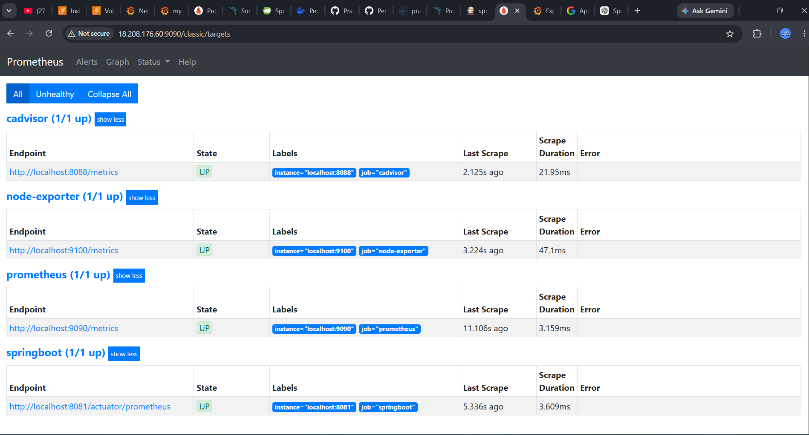

The Prometheus dashboard displays configured scrape targets, metric collection status, and query results, confirming successful monitoring of the application and infrastructure.

---

# 🖥️ Node Exporter

Node Exporter exposes Linux system metrics to Prometheus.

It enables infrastructure monitoring by collecting detailed information from the EC2 instance hosting the DevSecOps environment.

Metrics include:

- CPU Usage
- Memory Usage
- Disk Utilization
- Network Traffic
- Load Average
- Filesystem Statistics
- System Uptime

This allows administrators to monitor server health alongside application performance.

---

# 📊 Grafana Dashboards

Grafana transforms raw Prometheus metrics into interactive dashboards that simplify monitoring and troubleshooting.

Real-time visualization enables quick identification of performance trends, resource utilization, and abnormal system behavior.

The dashboards update automatically as new metrics are collected.

---

## 📈 Dashboard Features

- Real-Time Monitoring
- Interactive Charts
- CPU Utilization
- Memory Usage
- Disk Usage
- Network Statistics
- JVM Metrics
- Application Health
- Infrastructure Performance
- Custom Panels

---

# 📷 Grafana Dashboard – Infrastructure

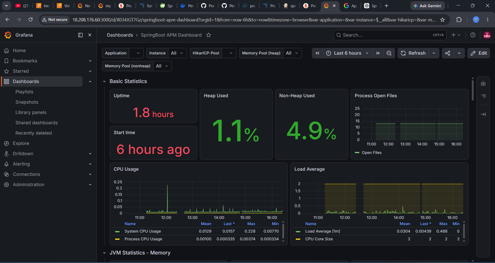

This dashboard visualizes infrastructure metrics collected from the EC2 instance, including CPU, memory, disk, and network utilization.

It provides a real-time overview of server health and resource consumption.

---

# 📷 Grafana Dashboard – Application

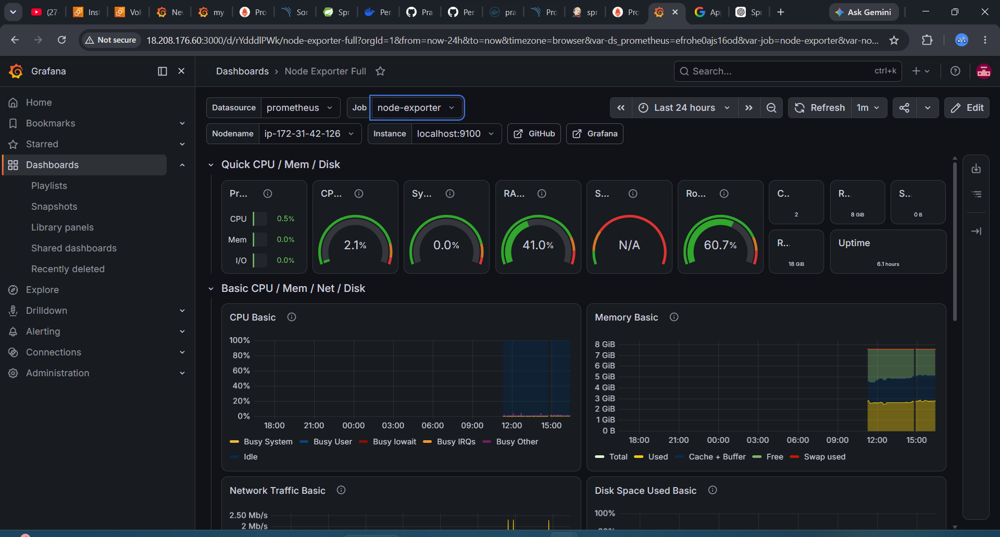

This dashboard focuses on Spring Boot application metrics exposed through Actuator and collected by Prometheus.

It helps monitor JVM performance, request metrics, uptime, and application health.

---

# 🚨 Alertmanager

Monitoring is only valuable when issues are detected and communicated promptly.

Alertmanager processes alerts generated by Prometheus and sends notifications whenever predefined thresholds are exceeded.

This enables proactive monitoring and rapid incident response.

---

## Alert Examples

Alerts can be triggered for events such as:

- High CPU Utilization
- High Memory Usage
- Low Disk Space
- Application Down
- Kubernetes Pod Failure
- Service Unreachable
- Node Failure
- High Error Rate

---

## Notification Workflow

```text
Spring Boot

      │

      ▼

Prometheus

      │

      ▼

Alert Rules

      │

      ▼

Alertmanager

      │

      ▼

Email Notification
```

---

# 📷 Alertmanager Configuration

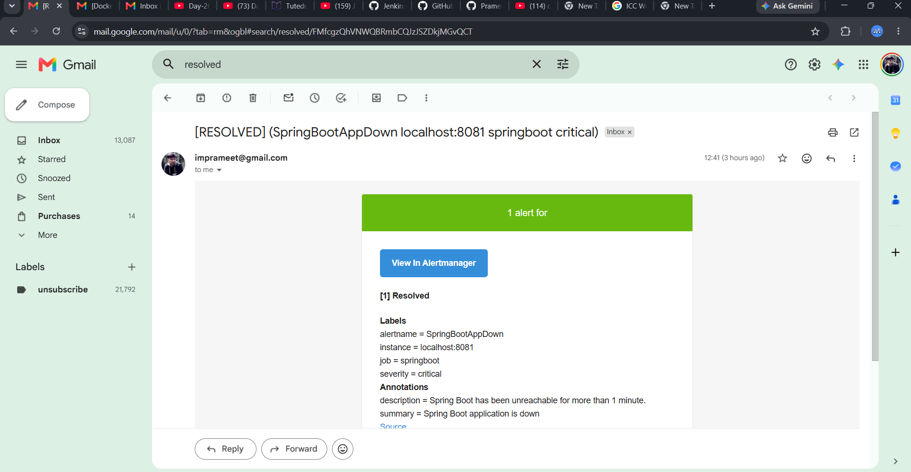

Alertmanager routes alerts to configured notification channels.

In this project, email notifications are configured so administrators receive immediate alerts whenever critical monitoring rules are triggered.

---

# 📊 Benefits of the Monitoring Stack

The implemented observability solution provides:

- Continuous Infrastructure Monitoring
- Real-Time Application Monitoring
- Centralized Metrics Collection
- Interactive Performance Dashboards
- Automated Alerting
- Faster Incident Detection
- Improved Troubleshooting
- Increased System Reliability
- Better Capacity Planning
- Production-Style Monitoring

---

# 🔄 Complete Monitoring Workflow

```text
Spring Boot Application
        │
        ▼
Spring Boot Actuator
        │
        ▼
Prometheus Scrapes Metrics
        │
        ▼
Stores Time-Series Data
        │
        ▼
Grafana Dashboards
        │
        ▼
Alert Rules Evaluated
        │
        ▼
Alertmanager
        │
        ▼
Email Notifications
```

---

# ✅ Observability Summary

This project implements a complete observability pipeline that continuously monitors both the application and the underlying infrastructure.

By integrating Prometheus, Grafana, Spring Boot Actuator, Node Exporter, and Alertmanager, the solution delivers real-time monitoring, insightful dashboards, and automated notifications—helping ensure the deployed application remains healthy, performant, and highly available.

---
# 📸 Project Walkthrough

The following screenshots demonstrate the successful implementation of the complete Enterprise DevSecOps pipeline, from source code management to cloud deployment and monitoring.

---

## 🔹 Source Code & Repository

| GitHub Repository |
|-------------------|
| 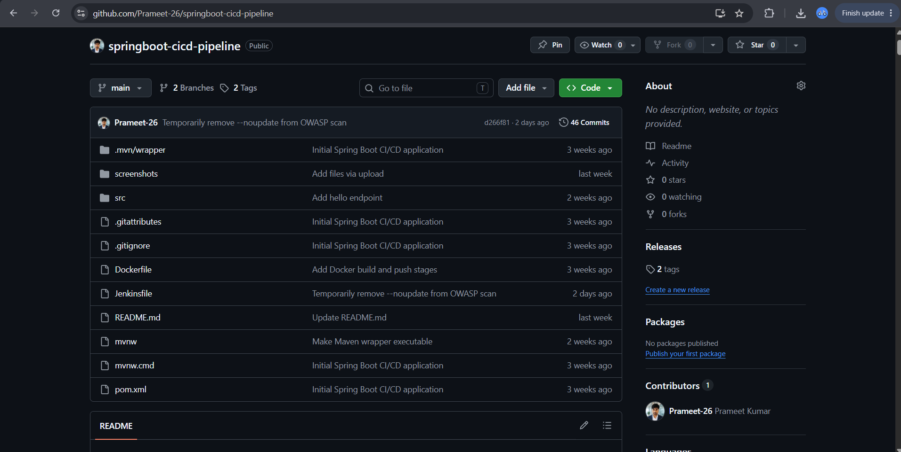 |

The GitHub repository serves as the central source code management platform, enabling version control, collaboration, and automated CI/CD pipeline execution through Jenkins.

---

## 🔹 Jenkins CI/CD Pipeline

| Jenkins Dashboard | Pipeline Execution |
|-------------------|--------------------|
|  |  |

The Jenkins dashboard displays all configured jobs and pipeline executions, while the pipeline view provides a graphical representation of each DevSecOps stage.

---

| Jenkins Console |
|-----------------|
|  |

The console logs provide detailed execution information for every pipeline stage, making troubleshooting and auditing straightforward.

---

## 🔹 Code Quality & Security

| SonarQube Dashboard | OWASP Dependency Report |
|----------------------|-------------------------|
|  |  |

Code quality is validated through SonarQube, while OWASP Dependency-Check scans third-party libraries for known vulnerabilities before deployment.

---

## 🔹 Docker & Container Registry

| Docker Build | Docker Hub Repository |
|---------------|-----------------------|
|  |  |

Docker packages the application into a portable container image, which is then published to Docker Hub for deployment to Amazon EKS.

---

## 🔹 Kubernetes Deployment

| Amazon EKS Cluster | Deployment |
|--------------------|------------|
|  |  |

Amazon EKS hosts the Kubernetes cluster responsible for orchestrating and managing the Spring Boot application.

---

| Running Pods | Kubernetes Services |
|--------------|---------------------|
|  |  |

Deployments, Pods, and Services work together to provide scalable, resilient, and highly available application hosting.

---

## 🔹 Application Verification

| Running Application |
|---------------------|
|  |

This confirms the successful end-to-end execution of the DevSecOps pipeline, resulting in a running Spring Boot application on Amazon EKS.

---

## 🔹 Monitoring & Observability

| Prometheus | Grafana Infrastructure |
|-------------|------------------------|
|  |  |

Prometheus continuously collects metrics from the application and infrastructure, while Grafana provides real-time visualization through interactive dashboards.

---

| Grafana Application Dashboard | Alertmanager |
|--------------------------------|--------------|
|  |  |

Alertmanager processes Prometheus alerts and sends automated email notifications when predefined conditions are met.

---

# 🏆 Project Achievements

This project successfully demonstrates:

- ✅ End-to-End Enterprise DevSecOps Implementation
- ✅ Automated CI/CD Pipeline with Jenkins
- ✅ Static Code Analysis using SonarQube
- ✅ Dependency Vulnerability Scanning using OWASP Dependency-Check
- ✅ Docker-Based Containerization
- ✅ Automated Deployment to Amazon EKS
- ✅ Kubernetes Orchestration
- ✅ Real-Time Monitoring with Prometheus
- ✅ Interactive Dashboards with Grafana
- ✅ Automated Email Notifications with Alertmanager
- ✅ Cloud-Native Deployment on AWS

---

# 💡 Challenges & Solutions

| Challenge | Solution |
|-----------|----------|
| Secure application delivery | Integrated SonarQube and OWASP Dependency-Check into the CI/CD pipeline |
| Consistent deployments | Automated Docker image creation and Kubernetes deployment |
| Infrastructure monitoring | Configured Prometheus with Node Exporter |
| Application monitoring | Enabled Spring Boot Actuator metrics |
| Centralized visualization | Built Grafana dashboards |
| Proactive incident detection | Configured Alertmanager email notifications |

---

# 🔐 DevSecOps Best Practices Implemented

- Shift-Left Security
- Automated Code Quality Checks
- Dependency Vulnerability Scanning
- Immutable Docker Images
- Kubernetes-Based Deployments
- Infrastructure as Code Ready
- Continuous Monitoring
- Automated Alerting
- Repeatable CI/CD Pipeline
- Cloud-Native Deployment Strategy

---

# 🎯 Skills Demonstrated

### DevOps

- Git & GitHub
- Jenkins
- Maven
- Docker
- Kubernetes
- Amazon EKS
- CI/CD Automation

### Cloud

- AWS EC2
- Amazon EKS
- IAM
- VPC
- Security Groups

### DevSecOps

- SonarQube
- OWASP Dependency-Check
- Shift-Left Security
- Quality Gates
- Software Composition Analysis (SCA)

### Monitoring

- Prometheus
- Grafana
- Alertmanager
- Node Exporter
- Spring Boot Actuator

### Programming

- Java 21
- Spring Boot
- REST APIs
- Maven

---

# 🚀 Future Enhancements

Future improvements for this project include:

- GitOps deployment using Argo CD
- Helm chart packaging
- Terraform-based infrastructure provisioning
- Kubernetes Ingress with AWS Load Balancer Controller
- Horizontal Pod Autoscaler (HPA)
- Secrets management with AWS Secrets Manager
- Trivy container image scanning
- Falco runtime security monitoring
- Centralized logging with the ELK or Loki stack
- Slack and Microsoft Teams alert integrations

---

# 📖 Key Takeaways

This project demonstrates how modern DevSecOps practices can automate software delivery while integrating quality assurance, security validation, cloud-native deployment, monitoring, and alerting into a single workflow.

By combining Jenkins, SonarQube, OWASP Dependency-Check, Docker, Amazon EKS, Prometheus, Grafana, and Alertmanager, the solution reflects many of the practices used in enterprise DevOps environments.

---

# 👨‍💻 Author

**Prameet Kumar**

DevOps & Cloud Engineer

### Connect With Me

- LinkedIn: *Add your LinkedIn profile*
- GitHub: https://github.com/Prameet-26

---

# ⭐ Support

If you found this project helpful, consider giving it a ⭐ on GitHub.

Feedback, suggestions, and contributions are always welcome.

---

# 📄 License

This project is available under the **MIT License**.

Feel free to use and modify it for learning purposes.

---

# 🙏 Thank You

Thank you for taking the time to explore this project.

I hope this repository provides valuable insights into building a secure, automated, and cloud-native DevSecOps pipeline using modern industry tools and best practices.
